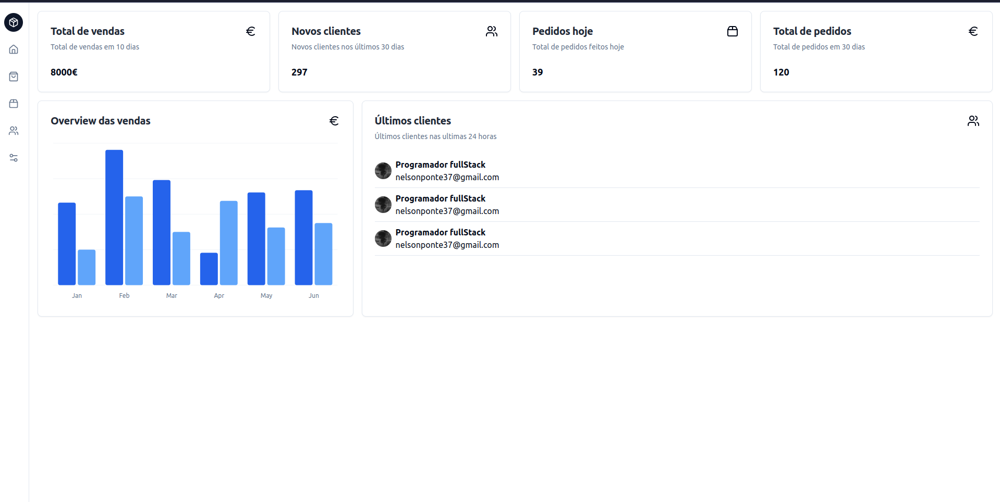

# Dashboard Project

This is a front-end dashboard project built using Next.js and Shadcn. The dashboard provides an overview of sales, new clients, and orders, with a visual representation of sales data over time

## Features

- **Sales Overview**: Displays total sales, new clients, and orders within specified periods.
- **Sales Chart**: Visual representation of sales data by month.
- **Client Information**: Displays the most recent clients who signed up in the last 24 hours.
- **Responsive Design**: Optimized for different screen sizes.

## Technologies Used

- **Next.js**: A React framework for building fast web applications.
- **Shadcn**: A utility-first CSS framework used for styling the application.
- **Chart.js**: (If applicable) Used for rendering the sales chart.
